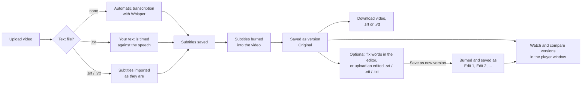
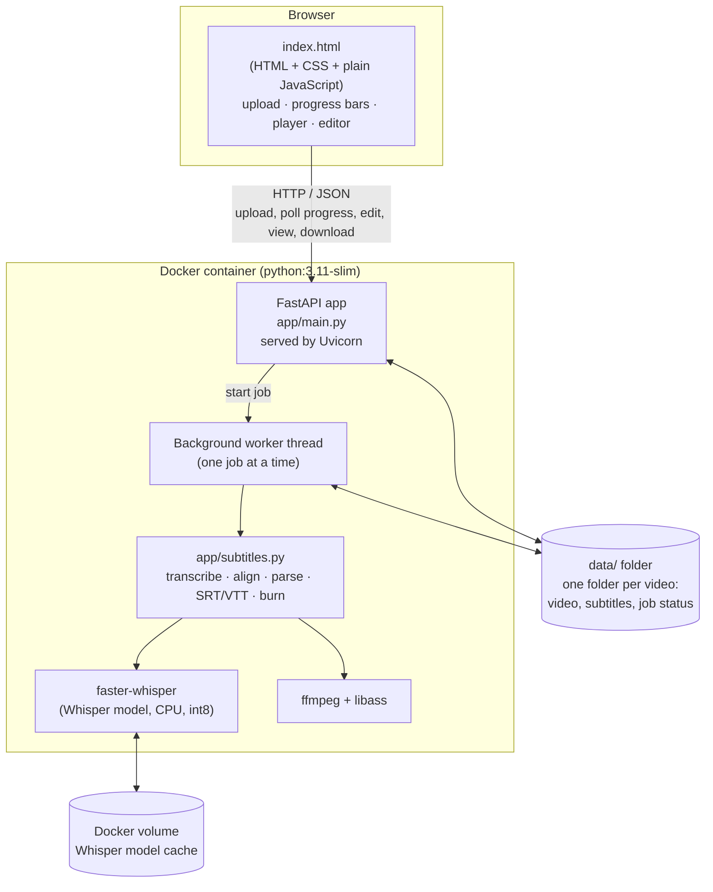
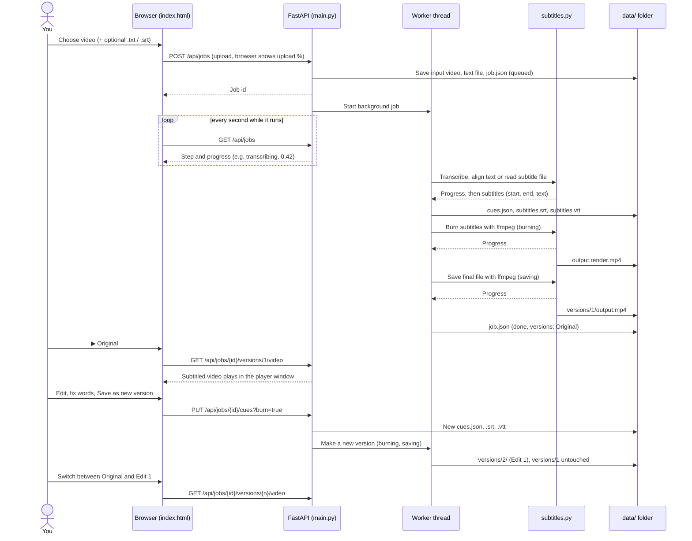
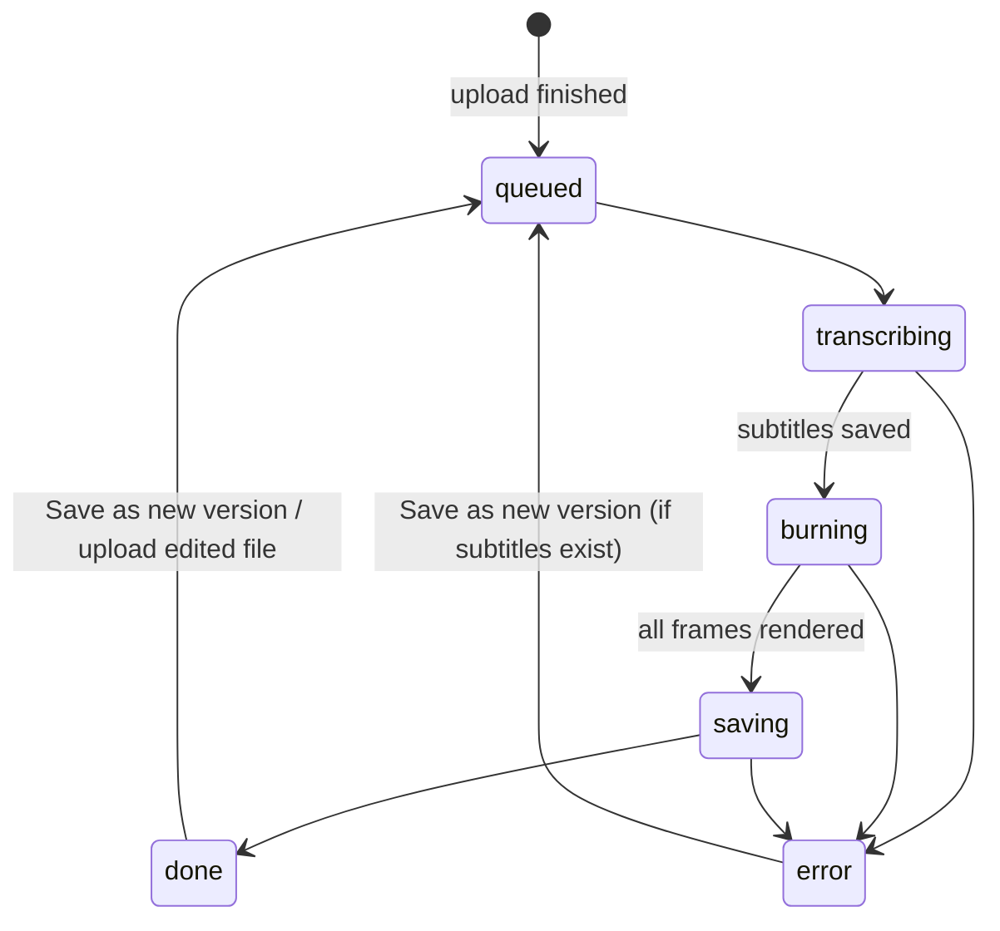

# Subtitles

A small web app that adds subtitles to videos. You upload a video in your browser and get it back with the subtitles **burned into the picture**, plus `.srt` and `.vtt` subtitle files.

The subtitles can come from three places:

1. **Automatic transcription.** The speech is transcribed by Whisper, an open-source speech-recognition model that runs on your own computer.
2. **Your own text (`.txt`).** You give the exact text that is spoken, with no timestamps. The app listens to the audio only to work out *when* each word is said.
3. **A ready-made subtitle file (`.srt` / `.vtt`).** It is used as it is.

Every video and its subtitles are saved, so you can come back later, **watch** the result in the app, fix badly transcribed words in an editor and make a **new version** of the video. The **original** stays next to every corrected version, so you can compare them side by side. While a video is processed, a **progress bar with percentage and time left** is shown for every step.

Everything runs locally: no API keys, no paid services, and your videos never leave the machine the app runs on.

---

## Contents

- [Quick start](#quick-start)
- [How to use it](#how-to-use-it)
- [Architecture](#architecture)
- [Technology stack](#technology-stack)
- [Project structure](#project-structure)
- [How the processing works](#how-the-processing-works)
- [Where files are stored](#where-files-are-stored)
- [HTTP API](#http-api)
- [Configuration](#configuration)
- [Limitations](#limitations)
- [Next steps: deployment](#next-steps-deployment)
- [Other ideas for later](#other-ideas-for-later)

---

## Quick start

### With Docker (recommended)

You only need [Docker Desktop](https://www.docker.com/products/docker-desktop/). Python, ffmpeg and Whisper are all installed inside the container.

```bash
git clone https://github.com/PepePapaPipi/subtitles.git
cd subtitles
docker compose up --build
```

Open <http://localhost:8000>. Stop it with `Ctrl+C`.

The first video takes longer because the Whisper model is downloaded (about 500 MB for the default `small` model). It is kept in a Docker volume, so later runs start right away.

### Without Docker

You need Python 3.10+ and [ffmpeg](https://ffmpeg.org/download.html) on your `PATH` (`winget install ffmpeg` on Windows, `brew install ffmpeg` on Mac, `sudo apt install ffmpeg` on Linux).

```bash
python -m venv .venv
.venv\Scripts\activate           # Mac/Linux: source .venv/bin/activate
pip install -r requirements.txt
uvicorn app.main:app --port 8000
```

Open <http://localhost:8000>.

---

## How to use it



### 1. Upload a video

On the home page, choose a video (or drag it in) and click **Add subtitles**.

- **Spoken language:** leave it on *Detect automatically*, or pick the language to make transcription a little faster and more reliable.
- **Your text (optional):** leave it empty for automatic transcription, or attach:
  - a **`.txt`** with what is said in the video. No timestamps are needed. Each line of the file starts a new subtitle, and long lines are split automatically. Your exact words, spelling and punctuation are kept.
  - a **`.srt`** or **`.vtt`** that already has timings. It is used as it is, without transcribing.

### 2. Follow the progress

A progress bar appears for each of the four steps, with the percentage done and an estimate of the time left:

| Step | What happens | How the % is measured |
|---|---|---|
| **Uploading video** | The file is sent from your browser to the app. | Bytes sent by the browser. |
| **Transcribing audio** (or *Matching your text to the speech* / *Reading your subtitle file*) | Whisper listens to the audio. | How far into the audio Whisper has got. |
| **Adding subtitles to the video** | ffmpeg draws the subtitles onto every frame. | How much of the video ffmpeg has rendered. |
| **Saving video** | ffmpeg writes the final file, ready to play in a browser. | How much of the video has been written. |

The upload bar is shown in the upload box. Once the upload is done, the video appears under **Your videos** and the other bars continue there. The time left is an estimate based on the speed so far, so it settles after the first few percent. Saving usually takes only a few seconds.

### 3. Watch the result and compare versions

Every video in the list has one **▶** button per version:

- **▶ Original** is the first video, made from the automatic transcription (or from the text you uploaded with the video).
- **▶ Edit 1**, **▶ Edit 2**, ... are the videos made later from corrected subtitles, oldest first.

Click one to open the player window. If there are several versions, buttons at the top switch between them **at the same moment of the video**, so you can compare the original subtitles with the corrected ones. Each version shows where its subtitles came from (*automatic transcription*, *edited in the app*, *from a subtitle file* or *from your text*).

The window also has buttons to download that version's video, `.srt` or `.vtt`, to go to the editor, and to **delete** an edited version you no longer need. The Original can only be deleted together with the whole video. Close the window with **Close**, the `Esc` key or by clicking outside it.

### 4. Review and fix the subtitles (optional)

Click **Edit** next to a video to open the editor:

- The left side plays the **original** video with your **current edits** shown as subtitles, so you see changes right away.
- The right side lists every subtitle with its **text**, **start** and **end** time in seconds.
  - Fix any word that was transcribed badly.
  - Click a time to jump the video there; the subtitle being shown is highlighted.
  - **Remove** a subtitle, or **Add subtitle at current time**.
- **Save** stores your changes as a draft, without making a video.
- **Save as new version** stores your changes and makes a new video from them, called *Edit 1*, then *Edit 2*, and so on. The Original and the earlier versions are not changed.
- **Upload an edited .srt, .vtt or .txt as a new version** is for subtitles corrected outside the app (for example in a text editor). A `.srt` / `.vtt` is used as it is; a `.txt` is timed against the speech, like at upload. The editor then shows the subtitles from that file.

If you try to leave the editor with unsaved changes, the page asks first.

While a new version is made, the same progress bars show its steps (*Reading your subtitle file* for an upload, then *Adding subtitles* and *Saving video*).

### 5. Download

From the player window (the version you are watching) or the editor (the newest version): **Download video** (subtitles burned in), **.srt** or **.vtt**. The file names say which version it is, for example `interview.subtitled.mp4` for the Original and `interview.edit1.subtitled.mp4` for Edit 1.

### 6. Everything stays saved

Every upload lives in its own folder under `data/` (see [Where files are stored](#where-files-are-stored)). It survives restarts of the app or of Docker. Click **Delete** in the list to remove a video and all its files.

---

## Architecture



### What happens during an upload



The app has three parts.

### Frontend: `app/static/index.html`

One single HTML file with inline CSS and **plain JavaScript** (no framework such as React, and no build step). It is served by the same Python server as the API.

- **Home view:** upload form and the list of saved videos. While a video is being processed, it asks the server for the status every second (polling) and draws a progress bar for each step. The time left is estimated in the browser from the progress so far and the time the step started.
- **Player window:** each version's **▶** button opens an HTML `<dialog>` with a `<video>` player, buttons to switch version (keeping the playback time), and download, edit and delete buttons.
- **Editor view** (`#/video/<id>`): an HTML5 `<video>` player plus an editable list of subtitles. The preview subtitles are a WebVTT track generated in the browser from your unsaved edits. It can also upload an edited subtitle file as a new version.
- It talks to the backend with `fetch` / `XMLHttpRequest` (the upload uses `XMLHttpRequest` to show upload progress).
- It follows the system light or dark mode and works on phone-sized screens.

### Backend: `app/main.py`

A **FastAPI** application run by the **Uvicorn** web server.

- Exposes the [HTTP API](#http-api) and serves the frontend.
- Saves each upload to `data/<job id>/` and starts a **background thread** to process it, so the upload returns right away.
- A lock makes sure only **one video is processed at a time**, because Whisper and ffmpeg each already use all CPU cores. Other uploads wait in the *queued* state.
- Job status is stored in `job.json` on disk (not in memory), so the list of videos survives restarts. If the server stops while a job is running, that job is marked as failed on the next start.
- Every finished video is a **version** in its own folder (`versions/1`, `versions/2`, ...), listed in `job.json`. A new version never overwrites an older one. Folders from before versions existed are moved into `versions/1` automatically when the app starts.
- While a step runs, its progress (0 to 1) and start time are written to `job.json`, at most once per percent. The file is written to a temporary file and swapped in, so the page never reads a half-written status.

### Processing: `app/subtitles.py`

All the subtitle logic, independent of the web layer:

| Function | What it does |
|---|---|
| `transcribe()` | Runs Whisper with word-level timestamps and turns the words into subtitles, reporting progress. |
| `align_text()` | Times your own `.txt` against the speech (see below). |
| `parse_subtitle_file()` | Reads `.srt` and `.vtt` files. |
| `group_words()` | Groups timed words into readable subtitles. |
| `to_srt()` / `to_vtt()` | Write the subtitle files. |
| `burn_subtitles()` | Calls ffmpeg to draw the subtitles onto the video, then to save the final file, reporting progress for both. |

---

## Technology stack

| Piece | Technology | Why |
|---|---|---|
| Language | **Python 3.11** | Whisper and the web server are Python. |
| Web framework | **FastAPI** | Small, fast, typed request validation, automatic API docs at `/docs`. |
| Web server | **Uvicorn** | Standard server for FastAPI. |
| File uploads | **python-multipart** | Lets FastAPI receive uploaded files. |
| Speech recognition | **[faster-whisper](https://github.com/SYSTRAN/faster-whisper)** | Open-source re-implementation of OpenAI's Whisper. Runs locally, about 4× faster than the original, with no API key. Models are downloaded for free from Hugging Face. |
| Video processing | **ffmpeg** with **libass** | Industry-standard tool. Draws the subtitles onto the frames and re-encodes the video as H.264, keeping the original audio. |
| Font | **DejaVu Sans** | Supports accents and most alphabets for the burned-in subtitles. |
| Frontend | **HTML + CSS + JavaScript** | One file, no framework and no build tools, easy to change. |
| Packaging | **Docker** + **Docker Compose** | Bundles Python, ffmpeg and all libraries, so it runs the same everywhere. |

Python dependencies are listed in `requirements.txt`.

---

## Project structure

```
subtitles/
├── app/
│   ├── __init__.py
│   ├── main.py            # FastAPI app: HTTP API, job storage, background worker
│   ├── subtitles.py       # Transcription, text alignment, SRT/VTT, burning with ffmpeg
│   └── static/
│       └── index.html     # The whole frontend (upload, video list, editor)
├── data/                  # Created at runtime: one folder per uploaded video (not in git)
├── Dockerfile             # How the image is built
├── docker-compose.yml     # How the container is run (port, volumes, settings)
├── .dockerignore          # Files left out of the image
├── .gitignore
├── requirements.txt       # Python libraries
└── README.md
```

### The Docker files

**`Dockerfile`** is the recipe for the image:

1. Start from `python:3.11-slim` (a small Debian Linux with Python).
2. Install `ffmpeg` and the DejaVu font with `apt-get`.
3. Install the Python libraries from `requirements.txt`.
4. Copy the `app/` folder in.
5. Start Uvicorn on port 8000.

**`docker-compose.yml`** says how to run it:

- maps port `8000` of the container to port `8000` of your computer;
- mounts `./data` into the container, so your videos are stored in the project folder on your computer;
- keeps the downloaded Whisper model in a named volume (`models`), so it isn't downloaded again;
- sets `WHISPER_MODEL`.

---

## How the processing works

### Automatic transcription

1. faster-whisper reads the audio straight from the video file. Voice activity detection skips silent parts.
2. It returns the text **with a start and end time for every word**, one segment at a time, in order. The progress is the end time of the latest segment divided by the length of the audio.
3. `group_words()` builds subtitles from those words. A subtitle ends:
   - at the end of a sentence (`.`, `?`, `!`),
   - when it would be longer than **42 characters**, or
   - when it would last longer than **6 seconds**.

### Your own text (`.txt`)

This is called *forced alignment*. The goal is to use **your words** with **Whisper's timing**.

1. Whisper transcribes the audio with word timestamps, exactly as above.
2. Both your text and Whisper's words are normalised (lower case, punctuation removed).
3. Python's `difflib.SequenceMatcher` finds the longest matching runs of words between the two lists, so each of your words that Whisper also heard gets that word's start and end time.
4. Words Whisper misheard or missed get times spread evenly between the matched words before and after them.
5. Subtitles are built with `group_words()`, which also starts a new subtitle at **every line break in your file**.
6. If fewer than 1 in 5 of your words can be matched, the job fails with a clear message, because the text probably belongs to a different video or language.

### Ready-made `.srt` / `.vtt`

The file is parsed directly (timings, multi-line text, VTT cue settings and tags such as `<i>` are handled) and no transcription runs.

### Burning the subtitles into the video

This happens in two ffmpeg runs, which are the *Adding subtitles* and *Saving video* steps.

**1. Adding subtitles.** ffmpeg's `subtitles` filter (based on libass) draws the subtitles onto every frame:

```
ffmpeg -i input.mp4 -vf "subtitles=subtitles.srt:force_style='FontSize=22,Outline=2,Shadow=0,MarginV=24'" \
       -c:v libx264 -preset veryfast -crf 20 -c:a copy output.render.mp4
```

The video is re-encoded as H.264 (`crf 20` is good quality); the audio is copied unchanged.

**2. Saving the video.** The rendered file is copied without re-encoding, moving its index to the start of the file (`+faststart`) so browsers can start playing it before it has fully loaded:

```
ffmpeg -i output.render.mp4 -c copy -movflags +faststart output.tmp.mp4
```

Then `output.tmp.mp4` is renamed to `output.mp4` and the intermediate file is deleted. All of this happens inside the new version's folder, so the other versions can be watched while it runs. If it fails, the unfinished version folder is removed.

**Progress.** Both runs use ffmpeg's `-progress pipe:1` option, which prints how far into the video it is (`out_time_us`) about twice a second. Divided by the video length (read with `ffprobe`), that gives the percentage.

### Job states



`transcribing`, `burning` and `saving` are the steps with a progress bar; each one stores its `progress` (0 to 1) and `stage_started` time in `job.json`.

---

## Where files are stored

Every upload gets a random id and its own folder:

```
data/
└── 42feb3a14fe04df194d6b2fde4daa48a/
    ├── input.mp4        # the original upload, never changed
    ├── text.txt         # only if you uploaded a text (.txt, .srt or .vtt)
    ├── version-text.srt # only if you uploaded an edited file as a new version
    ├── cues.json        # the subtitles the editor is working on
    ├── subtitles.srt    # generated from cues.json
    ├── subtitles.vtt    # generated from cues.json
    ├── job.json         # status, progress, versions, file name, language, dates, errors
    └── versions/
        ├── 1/           # Original
        │   ├── cues.json, subtitles.srt, subtitles.vtt   # frozen copy of its subtitles
        │   └── output.mp4                                 # the video with subtitles burned in
        └── 2/           # Edit 1, same files
```

While a version is being made, two temporary files can also appear in its folder: `output.render.mp4` and `output.tmp.mp4`. They are removed or renamed when it finishes. Each version is a full video file, so it takes about as much space as the upload; delete versions you don't need from the player window.

`job.json` looks like this while a video is being processed:

```json
{
  "id": "42feb3a14fe04df194d6b2fde4daa48a",
  "filename": "interview.mp4",
  "source": "automatic",
  "status": "burning",
  "progress": 0.42,
  "stage_started": "2026-10-04T17:12:08+00:00",
  "language": "es",
  "cues": 12,
  "making_version": "Edit 1",
  "versions": [
    { "n": 1, "name": "Original", "source": "automatic", "cues": 12, "created": "2026-10-04T17:08:55+00:00" }
  ]
}
```

`cues.json` looks like this:

```json
[
  { "start": 0.5, "end": 2.6, "text": "Hello everyone, this is a test of the" },
  { "start": 2.6, "end": 3.5, "text": "subtitle app." }
]
```

To back up your work, copy the `data/` folder. To free space, delete videos from the app (or delete their folders).

---

## HTTP API

The frontend uses these endpoints. FastAPI also shows interactive documentation at <http://localhost:8000/docs>.

| Method | Path | What it does |
|---|---|---|
| `GET` | `/api/jobs` | List all saved videos, newest first. |
| `POST` | `/api/jobs` | Upload a video. Form fields: `file` (video, required), `text` (`.txt`/`.srt`/`.vtt`, optional), `language` (e.g. `es`, optional). |
| `GET` | `/api/jobs/{id}` | Status of one video, with `status`, `progress` and `stage_started` while it is processed. |
| `DELETE` | `/api/jobs/{id}` | Delete a video and all its files. |
| `GET` | `/api/jobs/{id}/cues` | The subtitles as JSON. |
| `PUT` | `/api/jobs/{id}/cues` | Save edited subtitles (JSON list). Add `?burn=true` to also make a new version of the video. |
| `POST` | `/api/jobs/{id}/versions` | Make a new version from an edited file. Form field: `text` (`.srt`/`.vtt`, or `.txt` to time against the speech). |
| `DELETE` | `/api/jobs/{id}/versions/{n}` | Delete one edited version (not the Original). |
| `GET` | `/api/jobs/{id}/versions/{n}/video` | The video of version `n` (player window and download; supports seeking). |
| `GET` | `/api/jobs/{id}/versions/{n}/srt` / `vtt` | The subtitles of version `n`. |
| `GET` | `/api/jobs/{id}/source` | The original video (used by the editor preview). |
| `GET` | `/api/jobs/{id}/video` | The video of the newest version. |
| `GET` | `/api/jobs/{id}/srt` / `vtt` | The subtitles of the newest version. |

Example with `curl`:

```bash
curl -F "file=@my-video.mp4" -F "text=@script.txt" -F "language=es" http://localhost:8000/api/jobs
```

---

## Configuration

| Setting | Where | Default | What it does |
|---|---|---|---|
| `WHISPER_MODEL` | `docker-compose.yml` (or environment variable) | `small` | Model size. See the table below. |
| Port | `docker-compose.yml`, `ports` | `8000` | Change the left number to use another port, e.g. `"9000:8000"`. |
| Subtitle length | `MAX_CHARS`, `MAX_DURATION` in `app/subtitles.py` | 42 chars, 6 s | When a subtitle is split. |
| Subtitle style | `style` in `burn_subtitles()` in `app/subtitles.py` | size 22, outline 2 | Font size, outline, distance from the bottom. |

Whisper model sizes (download size; speed is for CPU):

| Model | Size | Speed | Accuracy |
|---|---|---|---|
| `tiny` | ~75 MB | fastest | lowest |
| `base` | ~150 MB | fast | fair |
| `small` | ~500 MB | medium | good (default) |
| `medium` | ~1.5 GB | slow | very good |
| `large-v3` | ~3 GB | slowest | best |

After changing the model, run `docker compose up --build` again.

---

## Limitations

- **No user accounts or login.** Everyone who can open the page sees, edits and can delete every video. That's fine on your own computer; read the deployment section before putting it online.
- **One video at a time.** Other uploads wait in the queue.
- **CPU only in the Docker image.** On a normal laptop, the `small` model takes roughly as long as the video itself, or a bit less. A GPU would be much faster (see below).
- **Uploads go fully into memory/disk on the server.** Very large videos (several GB) work but take a while to upload.
- **Burned-in subtitles can't be turned off** by the viewer. Use the `.srt`/`.vtt` files when you need switchable subtitles (YouTube, video players, editing software).

---

## Next steps: deployment

Right now the app runs on your own computer. These are the options to make it available to others, from simplest to most complete.

### Option A: share the image on Docker Hub

Other people can run the app without the source code and without building it. They still need Docker on their own computer.

1. Create a free account at <https://hub.docker.com>.
2. Build and upload the image:

   ```bash
   docker login
   docker build -t YOUR-DOCKERHUB-USER/subtitles:1.0 .
   docker push YOUR-DOCKERHUB-USER/subtitles:1.0
   ```

3. Anyone can then run it with:

   ```bash
   docker run -p 8000:8000 -v subtitles-data:/app/data -v subtitles-models:/root/.cache/huggingface YOUR-DOCKERHUB-USER/subtitles:1.0
   ```

Notes:

- A public repository on Docker Hub is visible to everyone. Choose *private* if the code shouldn't be shared (the free plan includes one private repository).
- If someone uses a Mac with Apple Silicon, build for both processors: `docker buildx build --platform linux/amd64,linux/arm64 -t YOUR-DOCKERHUB-USER/subtitles:1.0 --push .`

### Option B: publish automatically to GitHub Container Registry

Same idea as Docker Hub, but the image is built by GitHub on every push and stored next to the code at `ghcr.io/pepepapapipi/subtitles`. It's free for public repositories.

Add `.github/workflows/docker.yml`:

```yaml
name: Publish Docker image
on:
  push:
    branches: [main]
permissions:
  contents: read
  packages: write
jobs:
  build:
    runs-on: ubuntu-latest
    steps:
      - uses: actions/checkout@v4
      - uses: docker/login-action@v3
        with:
          registry: ghcr.io
          username: ${{ github.actor }}
          password: ${{ secrets.GITHUB_TOKEN }}
      - uses: docker/build-push-action@v6
        with:
          push: true
          tags: ghcr.io/${{ github.repository }}:latest
```

Then run it anywhere with `docker run -p 8000:8000 ghcr.io/pepepapapipi/subtitles:latest`.

### Option C: host it online on Hugging Face Spaces

People just open a web link; they install nothing. Hugging Face Spaces can run any Docker app.

What needs to change:

1. **Create a Space** at <https://huggingface.co/new-space>, choose **Docker** as the SDK, and choose **Private** visibility if the videos are confidential (a public Space can be used by anyone on the internet).
2. **Add a header to the top of this README** (Spaces reads its settings from it):

   ```yaml
   ---
   title: Subtitles
   sdk: docker
   app_port: 8000
   ---
   ```

3. **Make the folders writable.** Spaces run the container as a normal user (id 1000), not as root. Add to the `Dockerfile`, before `CMD`:

   ```dockerfile
   RUN useradd -m -u 1000 user && mkdir -p /app/data && chown -R user /app
   USER user
   ENV HF_HOME=/home/user/.cache/huggingface
   ```

4. **Push the code** to the Space's git repository (or link it to this GitHub repo).

Things to know:

- The free **CPU basic** hardware (2 vCPU, 16 GB RAM) works but is slow; use the `base` or `small` model. A paid GPU (from about $0.40/hour) makes transcription many times faster.
- **Storage is temporary on the free tier.** `data/` is wiped when the Space restarts or goes to sleep after inactivity. For permanent storage, enable the paid *Persistent storage* option and point the data folder to `/data`.
- Uploads are limited in size by Spaces, so very long videos may not work.

### Option D: your own server or cloud

Any Linux server or cloud VM with Docker (company server, AWS, Azure, Google Cloud, Hetzner, DigitalOcean…) can run it with `docker compose up -d`. Recommended: at least 2 CPUs and 4 GB of RAM, or a GPU for speed. Put it behind a reverse proxy (Caddy or Nginx) to get HTTPS.

### What to add before real online use

Whichever option you pick, if the app will be reachable by people other than you:

| Need | Why | How |
|---|---|---|
| **Login** | Without it anyone with the link sees and deletes all videos. | Simplest: a shared password (HTTP Basic Auth in FastAPI or at the reverse proxy). Better: company login (Microsoft/Google SSO). |
| **Per-user video lists** | So colleagues only see their own videos. | Store the owner in `job.json` and filter the list. |
| **Upload size limit** | Protects the server's disk. | Check the size in `create_job`, or set it in the reverse proxy. |
| **Automatic clean-up** | Videos take a lot of space. | Delete jobs older than N days on start-up or with a scheduled task. |
| **GPU support** | Much faster transcription. | Build from an `nvidia/cuda` base image with cuDNN and run with `--gpus all`; faster-whisper uses the GPU automatically. |
| **Job queue** | Process several videos in parallel across machines. | Replace the background thread with a queue such as Celery or RQ with Redis. |
| **Company data rules** | Work videos may be confidential. | Check with IT where videos may be stored; prefer a private Space or a company server. |

---

## Other ideas for later

- Translate subtitles into other languages.
- Choose the subtitle style (font, size, colour, position) from the page.
- Split or merge subtitles in the editor, and drag their timing on a waveform.
- Export only the subtitles without re-encoding the video (soft subtitles inside an `.mp4` or `.mkv`).
